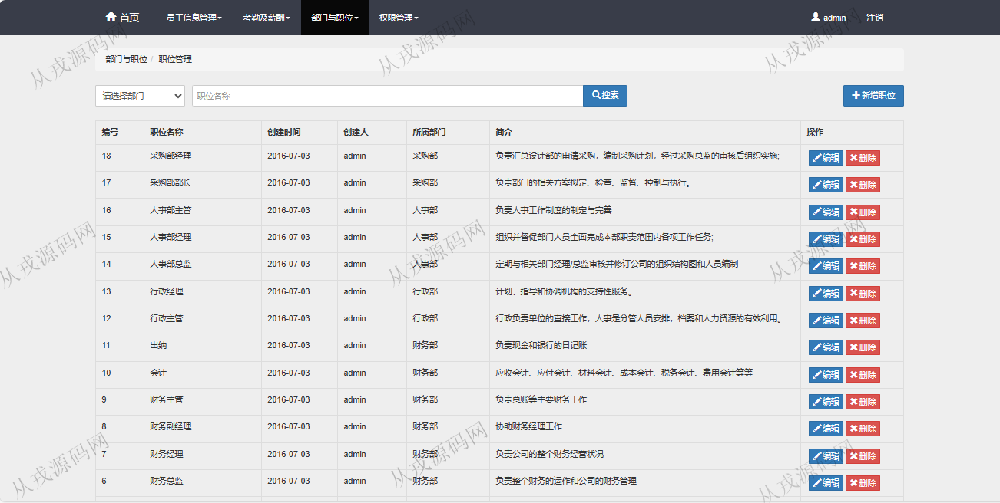

<h1 align="center">218.公司人员信息管理系统</h1>

 获取sql文件 QQ: 386869957 QQ群: 377586148 

 [更多源码项目: 从戎源码网](https://armycodes.com/) 

## 简介

> 本代码来源于网络,仅供学习参考使用!
>
> 提供1.远程部署/2.修改代码/3.设计文档指导/4.框架代码讲解等服务
>
> http://localhost:8080/mgr/
> 
> admin 123456
>

## 项目介绍
基于ssh的公司人员信息管理系统：前端 html、jquery、bootstrap，后端 springmvc、spring、hibernate；角色分为管理员、员工；集成员工信息管理、部门与职位管理、权限管理等功能于一体的系统。

## 功能介绍

- 员工信息管理：实习员工、正式员工、离职员工信息的增删改查，员工录取，员工淘汰，员工培训，员工离职，员工记录，按员工姓名活身份证号搜索
- 培训项目：新建培训项目，详情，记录，开始，编辑，按姓名名称模糊搜索
- 部门管理：部门信息的增删改查，按部门名称模糊搜索，给部门设置经理
- 职位管理：职位信息的增删改查，按职位名称模糊搜索
- 账号管理：账号信息的增删改查，初始密码，角色管理
- 角色管理：角色信息的增删改查，给角色分配模块权限

## 环境

- <b>IntelliJ IDEA 2021.3</b>

- <b>Mysql 5.7.26</b>

- <b>Tomcat 7.0.73</b>

- <b>JDK 1.8</b>

## 运行截图

